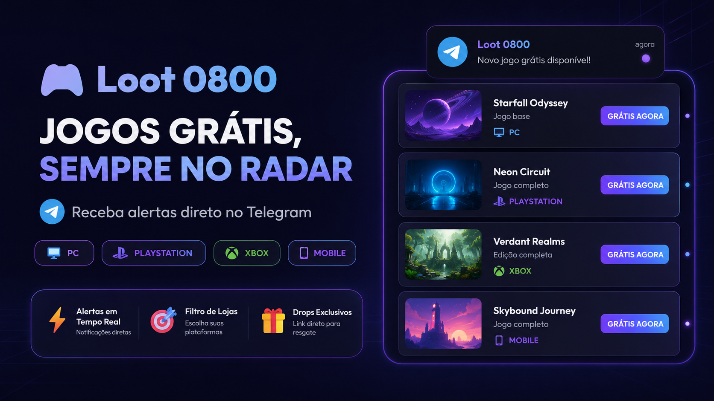

<div align="center">

# 🎮 LOOT 0800
### O seu radar automático de jogos grátis para PC, Consoles e Mobile diretamente no Telegram!

[](https://loot.servidor.xyz.br)
[](https://t.me/Loot0800Bot)
[](docker-compose.yml)
[](package.json)
[](database.js)
[](https://pixgg.com.br/rzao)

<br/>

**🔗 Acesse o Portal Oficial:** [https://loot.servidor.xyz.br](https://loot.servidor.xyz.br)  
**🤖 Converse com o Bot:** [@Loot0800Bot no Telegram](https://t.me/Loot0800Bot)  
**☕ Apoie o Projeto:** [https://pixgg.com.br/rzao](https://pixgg.com.br/rzao)

<br/>



---

</div>

## 📌 Sobre o Projeto

O **Loot 0800** é um bot completo de Telegram desenvolvido em Node.js focado em encontrar e alertar você instantaneamente sempre que um jogo pago fica **100% gratuito (0800)** por tempo limitado. 

O sistema monitora ativamente as principais plataformas do mercado e entrega cartões detalhados com imagem, preço original riscado, plataforma e o link direto para resgate na sua biblioteca.

---

## 🚀 Principais Funcionalidades

- **🎮 Suporte Multiplataforma Completo:**
  - **PC & Lojas Digitais:** Epic Games Store, Steam, GOG.com, Amazon Prime Gaming e Itch.io.
  - **Consoles:** PlayStation (PS4 / PS5), Xbox (One / Series X|S) e Nintendo Switch.
  - **Mobile:** Android (Google Play) e iOS (App Store).
- **⚡ Alertas Automáticos em Tempo Real:** Worker integrado via agendamento `cron` com a API da GamerPower para busca periódica de novas oportunidades.
- **🛡️ Sistema Anti-Spam & Histórico:** Registro persistente no SQLite (`notified_games`) para garantir que nenhum drop seja notificado duas vezes e limitação inteligente de envio por ciclo.
- **🎯 Portal Web de Preferências:** Interface moderna *dark-mode* servida pelo Express para que o usuário personalize quais lojas deseja monitorar (`https://loot.servidor.xyz.br/?chatId=...`).
- **🔘 Inline Keyboards no Telegram:** Painel interativo com botões (`✅ / ❌`) diretamente no chat do Telegram via comando `/config`.
- **🎁 Onboarding Instantâneo:** Botão interativo *"Ver Jogos Recentes agora"* no comando `/start` para receber os drops ativos no momento sob demanda.
- **🐳 Deploy Simplificado com Docker:** Configurado com `Dockerfile` leve (`node:20-alpine`) e `docker-compose.yml` pronto para deploy no Portainer ou VPS com volume persistente.

---

## 🤖 Comandos do Bot

| Comando | Descrição |
| :--- | :--- |
| `/start` | Registra o usuário no radar e exibe o botão de onboarding para ver jogos ativos. |
| `/config` | Abre o painel interativo (Inline Keyboard + link para o portal Web) para selecionar as plataformas de interesse. |

---

## 🛠️ Tecnologias Utilizadas

- **Runtime:** [Node.js](https://nodejs.org/) (v20+ LTS)
- **Servidor Web:** [Express.js](https://expressjs.com/)
- **Telegram SDK:** [node-telegram-bot-api](https://github.com/yagop/node-telegram-bot-api) (Modo Polling)
- **Banco de Dados:** [SQLite3](https://www.sqlite.org/) (Armazenamento leve e embarcado)
- **Agendamento:** [node-cron](https://github.com/node-cron/node-cron)
- **Requisições HTTP:** [Axios](https://axios-http.com/)
- **Fonte de Dados:** [GamerPower Giveaways API](https://www.gamerpower.com/api-reference)
- **Containerização:** [Docker](https://www.docker.com/) & [Docker Compose](https://docs.docker.com/compose/)

---

## 📁 Estrutura do Repositório

```text
loot-0800/
├── data/                    # Volume persistente do SQLite (database.sqlite)
├── public/                  # Frontend Web
│   └── index.html           # Landing Page e Portal de Preferências
├── .dockerignore            # Regras de exclusão do Docker
├── .env.example             # Template de variáveis de ambiente
├── .gitignore               # Regras de exclusão do Git
├── database.js              # Módulo de inicialização e queries do SQLite
├── docker-compose.yml       # Orquestração do container Docker
├── Dockerfile               # Imagem Alpine otimizada com build do SQLite
├── index.js                 # Ponto de entrada: Servidor Express e Bot Telegram
├── package.json             # Dependências e scripts do Node.js
├── README.md                # Documentação oficial do projeto
└── worker.js                # Coleta da API, filtro de preferências e disparos
```

---

## ⚙️ Variáveis de Ambiente

Crie um arquivo `.env` na raiz do projeto com base no template [`.env.example`](.env.example):

```env
# Token HTTP API fornecido pelo @BotFather no Telegram
TELEGRAM_BOT_TOKEN=seu_token_aqui

# Porta em que o servidor web Express irá escutar (padrão: 3000)
PORT=3000

# URL pública oficial do projeto (usada para gerar os links do portal no Telegram)
PUBLIC_URL=https://loot.servidor.xyz.br
```

---

## 🚀 Como Executar Localmente

### Pré-requisitos
- [Node.js 18+](https://nodejs.org/) instalado
- [Git](https://git-scm.com/) instalado

### Passo a Passo

1. **Clone o repositório:**
   ```bash
   git clone https://github.com/renan-portes/loot-0800.git
   cd loot-0800
   ```

2. **Instale as dependências:**
   ```bash
   npm install
   ```

3. **Configure as variáveis de ambiente:**
   ```bash
   cp .env.example .env
   # Edite o .env e insira o seu TELEGRAM_BOT_TOKEN
   ```

4. **Inicie o bot:**
   ```bash
   npm start
   # ou: node index.js
   ```

5. Acesse no navegador: `http://localhost:3000`

---

## 🐳 Executando com Docker & Docker Compose

Para rodar a aplicação em container com persistência automática de dados:

```bash
# Subir o container em background
docker compose up -d --build

# Visualizar os logs da aplicação
docker compose logs -f loot-bot

# Parar a aplicação
docker compose down
```

---

## 🌐 Deploy em Produção (Portainer / Reverse Proxy)

1. Crie uma nova **Stack** no Portainer apontando para este repositório Git:
   - **Repository URL:** `https://github.com/renan-portes/loot-0800.git`
   - **Target reference:** `refs/heads/main`
   - **Compose path:** `docker-compose.yml`
2. Adicione as variáveis de ambiente na interface do Portainer:
   - `TELEGRAM_BOT_TOKEN=seu_token_aqui`
   - `PORT=3000`
   - `PUBLIC_URL=https://loot.servidor.xyz.br`
3. Configure o **Nginx Proxy Manager** (ou Traefik/Caddy) para apontar o domínio `loot.servidor.xyz.br` para a porta do container com certificado SSL Let's Encrypt ativado.

---

## 📄 Licença

Este projeto está sob a licença [ISC](LICENSE). Sinta-se livre para usar, contribuir e compartilhar!

<div align="center">
  <sub>Desenvolvido com 💜 para a comunidade gamer. Drops 100% gratuitos! 🎮</sub>
</div>
